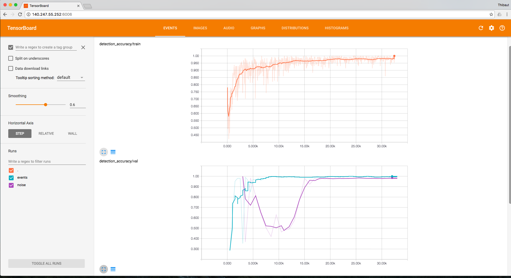
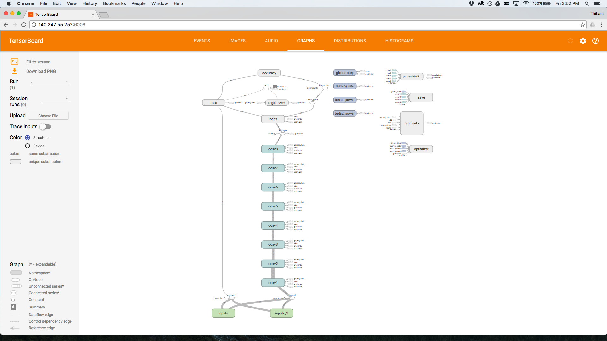

# Nevera_Quake


I extend special gratitude to the researchers whose openness and willingness to collaborate have greatly contributed to this work:
Perol., T, M. Gharbi and M. Denolle. Convolutional Neural Network for Earthquake detection and location. *Science Advances*, Vol. 4, no. 2, e1700578, DOI: 10.1126/sciadv.1700578, 2018 [Link](http://advances.sciencemag.org/content/4/2/e1700578).

## Installation
* Download repository
* Install dependencies: `pip install -r requirements.txt`
* Add directory to python path: `./setpath.sh`
* Run tests: `./runtests.sh` (THIS NEEDS TO BE EXTENDED)
* Download the [data](https://www.dropbox.com/sh/3p9rmi1bcpvnk5k/AAAV8n9VG_e0QXOpoofsSH0Ma?dl=0) (roughly 70 Gb) and symlink to `data` 
`ln -s data Downloads/data`
* Download the [pre-trained models](https://www.dropbox.com/sh/t9dj8mmfx1fmxfa/AABSJQke8Ao6wfRnKMvQXipta?dl=0) and symlink to `models` 
`ln -s models Downloads/models`

## Data

Nevera_Quake is trained on data from Oklahoma (USA). 
The continuous waveform data and earthquake catalog are publicly available at https://www.iris.edu/hq/ and http://www.ou.edu/ogs.html

The `data` directory contains:
* `streams`: 2.5 years of monthly streams from GSOK029 and GSOK027 in .mseed 
* `catalogs`: earthquake catalogs the OGS (years 2014 to 2016) and from Benz et al. 2015 (Feb. to Sept. 2014)
* `6_clusters`: windows used for training and testing of Nevera_Quake with 6 geographic areas
* `50_clusters`: windows used for training and testing of Nevera_Quake with 50 geographic areas
* `known_template`: template T_1 used to generate synthetic data 
* `unknown_template`: template T_2 used to generate synthetic data 
* `synth`: directory of synthetic data for testing 

## Trained models

The directory `models` contains:
* `Nevera_Quake`: trained model for 6 geographic areas 
* `50_clusters`: trained model for 50 geographic areas 
* `synth`: trained model on synthetic data

## 1 - What will you find in this repository ?

Nevera_Quake is a convolutional neural network that detect and locate events from a single waveform.
This repository contains all the codes used to write our paper. 
For each step, we provide the commands to run.

## 2 - Train Nevera_Quake on a dataset

Steps to train the network on a dataset of waveforms:

- Use a catalog of located events and partition them into clusters. This create a new catalog of labeled events. The script is in `bin/preprocess`.
- Load month long continuous waveform data. Preprocess them (mean removal, normalization). Use the catalog of labeled events to create event windows from the continuous waveform data. Use a catalog to create noise windows from continuous waveform data. The codes are in `bin/preprocess`.
- Train Nevera_Quake on the training windows, visualize of the training and evaluate on a test windows. The codes are in `bin/`.

Sections 2.1, 2.2 and 2.3 are required to reproduce the windows in `data/6_clusters/detection`
Section 2.4 for training and testing of the network, also provided in `models/Nevera_Quake`

### 2.1 - Partition earthquakes into clusters

Load the OGS catalog. 
Filter to keep the events located in the region of interest and after 15 February 2014. 
To partition the events into 6 clusters using K-Means, run:

```shell
./bin/preprocess/cluster_events --src data/catalogs/OK_2014-2015-2016.csv\
--dst data/6_clusters --n_components 6 --model KMeans
```

This outputs in `data/6_clusters`:
* `catalog_with_cluster_ids.csv`: catalog of labeled events
* `clusters_metadata.json`: number of events per clusters. 

The code also plots the events on a map. 
The colored events are the training events, the black events are the events in the test set (July 2014).

The cluster labels range from 0 to M-1 with M the number of clusters chosen with `--n-components`. 

### 2.2 Create labeled windows of events

Load a directory of month long streams and a catalog of labeled events. 
The script preprocess the month long streams (remove the mean, normalization). 
Using the origin time of the cataloged events and a mean seismic velocity between the station and the event location, we create 10 second long event windows.

```shell
./bin/preprocess/create_dataset_events.py --stream_dir data/streams\
--catalog data/6_clusters/catalog_with_cluster_ids.csv \
--output_dir data/6_clusters/events \
--save_mseed True --plot True
```

This create tfrecords containing all the event windows. 
Pass `—-save_mseed` to save the windows in .mseed. Pass `—-plot` to save the events in .png.

`data_augmentation.py` adds Gaussian noise and can stretch or shift the signal to generate new tfrecords. 

```shell
./bin/preprocess/data_augmentation.py --tfrecords data/6_clusters/events \
--output data/6_clusters/augmented_data/augmented_stetch_std1-2.tfrecords \
--std_factor 1.2
```

You can pass various flags: `--plot` plot the generated windows, `-—compress_data` compress the signal, `-—stretch_data` stretch the signal, `-—shift_data` shifts the signal. 

In Perol et al., 2017 we only add Gaussian noise. 
The other data augmentation techniques do not improve the accuracy of the network.

### 2.3 Create windows of noise

Load one month long stream and a catalog, preprocess the stream and create noise windows labeled with -1. 

```shell
./bin/preprocess/create_dataset_noise.py \
--stream_path data/streams/GSOK029_8-2014.mseed \
--catalog data/catalogs/Benz_catalog.csv \
--output_dir data/noise_OK029/noise_august
```

This generates 10 second long windows when there is no event in the catalog. 
Check the flags in the code if you want to change this. 
`-—max_windows` controls the maximum number of windows to generate. 
The `-—plot` and `—-save_mseed` are available.

Note that in the case we do not account for the travel time because the detection times in Benz et al. 2015 correspond to the detected seismogram signal.

### 2.4 Train Nevera_Quake and monitor the accuracy on train and test sets

We split the tfrecords of windows for training and testing. The training set has two directories: 
`positive` containing the event windows and `negative` containing the noise windows.

To train Nevera_Quake (GPU recommended):

```shell
./bin/train --dataset data/6_clusters/train --checkpoint_dir output/Nevera_Quake --n_clusters 6
```

This outputs checkpoints with saved weights and tensorboard events in the directory given by the `checkpoint_dir` flag.
The checkpoints are named after the number of steps done during training. 
For example `model-500` correspond to the weights after 500 steps of training. 
The configuration parameters (batch size, display step etc) are in `quakenet/config.py`. 

The network architecture is stored in `quakenet/models.py`. 

Note that we also provide the trained model in `models/Nevera_Quake`.

During training, there are two things to monitor: the accuracy on the noise windows and the accuracy on event windows (CPUs are fine here). 
In both scripts, pass an integer in seconds to `--eval_interval` to set the time between each evaluation.  

```shell
./bin/evaluate --checkpoint_dir output/Nevera_Quake/Nevera_Quake \
--dataset data/6_clusters/test_events \
--eval_interval 10 --n_clusters 6 \
--events
```

```shell
./bin/evaluate --checkpoint_dir output/Nevera_Quake/Nevera_Quake \
--dataset data/6_clusters/test_noise --eval_interval 10 \
--n_clusters 6 --noise
```

You can visualize the accuracy on the train and test set while the network is training. 
The accuracy for detection and for location is implemented. Run:

```shell
tensorboard --logdir output/Nevera_Quake/Nevera_Quake
```



You can also visualize the network architecture with tensorboard



## 3 - Detecting and locating events in continuous waveform data

There are two methods for detecting events from continuous waveform data. 
The first one is relatively slow, it loads a .mseed and generate windows. While the windows are generated they are fed to Nevera_Quake that makes the classification. 
A faster method does the classification from tfrecords. First windows, a generated and saved into tfrecords. Then the tfrecords are analyzed and classified by Nevera_Quake to create a catalog of events.

This second methods analyze one month of data in 4 min on a MacbookPro.


Stream and catalog loaders are in `quakenet/data_io.py`.

`quakenet/data_pipeline.py` contains all the
preprocessing/conversion/writing/loading of the data used by the
network.

`quakenet/synth_data.py` contains the code that generates synthetic data from
a set of templates 

`quakenet/models.py` contains the tensorflow code for the architecture of Nevera_Quake

Tensorflow base model and layers can be found in `tflib` repository.
